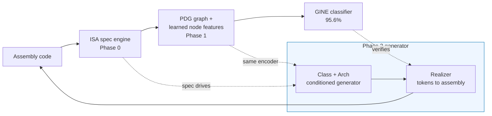

# SpecDiscover — Progress Summary (this pass)

**From a detector toward a generator.** The existing system (SpecExec) is a graph
neural network that *classifies* a snippet of assembly into one of 10
speculative-execution vulnerability classes at **95.6%** accuracy. This pass adds
three verified building blocks that (a) make the system architecture-agnostic,
(b) let it learn its own features, and (c) *generate* new candidate gadgets on
demand. Each block is held to the existing system as a reference and measured.

> **One-line version:** refactored the ISA knowledge into a config (proven
> identical), showed a self-supervised encoder can replace the hand-designed
> per-instruction features at equal accuracy, and built a class- and
> architecture-steerable generator of novel candidate gadgets — with leak
> confirmation deliberately left to the next phase.

---

## The pipeline




The generator (Phase 2) proposes gadgets; the classifier checks them; the spec
engine and learned encoder are shared across detection and generation. The
missing top-right piece — a real leak oracle (gem5) — is the next phase.

---

## Phase 0 — ISA knowledge moved from code into a spec

**Before:** x86/ARM rules were hardcoded regexes in Python. **After:** a
declarative JSON spec, read by a generic engine. New architecture = new config,
not new code.

**Real spec content** (ordered classification rules + speculation-flag rules —
note these read like a data sheet, not code):

```jsonc
// base.json  
"classify_rules": [
  { "kind": "simple", "pat": "fence",  "cat": "FENCE" },
  { "kind": "simple", "pat": "cache",  "cat": "CACHE" },
  { "kind": "simple", "pat": "timing", "cat": "TIMING" },
  { "kind": "simple", "pat": "ret",    "cat": "RET" }
],
"spec_flag_rules": [
  // an INDEXED load is the Spectre-v1 secret read...
  { "when_cat_in": ["LOAD"], "when_mem_in": ["INDEXED"], "set": "is_secret_source" },
  // ...and doubles as the covert-channel transmitter
  { "when_cat_in": ["LOAD"], "when_mem_in": ["INDEXED","INDIRECT"], "set": "is_transmitter" }
]
```

```jsonc
// x86_64.json  (thin per-ISA file: inherits base, adds pipeline + realize)
{ "extends": "base.json", "arch": "x86_64",
  "pipeline": { "speculative_window": 10, "cache_window": 20, "rsb_pair_window": 15,
                "speculation_sources": ["BRANCH_COND","CALL_INDIRECT","JUMP_INDIRECT","RET"] },
  "realize":  { "register_pool": ["%rax","%rbx","%rcx","..."], "mem_idx": "(%BASE,%IDX)" } }
```

**Verification — old vs. new, zero differences:**


| Check                                                  | Units compared                | Mismatches |
| ------------------------------------------------------ | ----------------------------- | ---------- |
| Node decisions (category / memory / flags / registers) | 25,942 instruction pairs      | **0**      |
| Full graph (nodes + all 9 edge types), window=20       | 207,113 nodes / 437,231 edges | **0**      |
| Full graph, window=10                                  | 207,113 nodes / 421,525 edges | **0**      |


✅ Same outputs, cleaner design. *(Scope: proven on x86 + ARM, both already
supported; RISC-V is expressible but not yet tried.)*

---

## Phase 1 — The model learns its own features (matches hand-tuned)

**Before:** a human decided what to measure per instruction (is it a load? which
registers?). **After:** a small self-supervised model learns its own
per-instruction representation from the assembly — like word2vec for opcodes.

Instructions are first normalized to shrink the vocabulary, then embedded:

```
movq  (%rsi,%rcx), %rax   -->   "movq <mem-idx> <reg>"
add   $1, %eax            -->   "add <imm> <reg>"
callq flush_reload        -->   "callq <fn>"
```

**Result A — feature ablation** (RandomForest; "learned" = zero hand-designed
features):


| Feature set                     | Test acc. | Macro-F1 |
| ------------------------------- | --------- | -------- |
| Hand-engineered (58)            | 95.2%     | 80.3     |
| **Learned only**, static (64)   | 91.3%     | 75.4     |
| Learned + spec-structural (84)  | 93.7%     | 78.6     |
| Hand + contextual-learned (122) | **95.5%** | **89.3** |


**Result B — learned features *inside the real GINE model***:


| Per-node vector        | dim | Test acc. | Macro-F1 |
| ---------------------- | --- | --------- | -------- |
| Hand nodes (reference) | 41  | 95.6%     | 81.0     |
| **Learned nodes**      | 65  | **95.0%** | 80.1     |
| Hand + learned nodes   | 105 | 94.7%     | 78.0     |


✅ Learned per-instruction features reach **parity** (0.6pp gap, within the
model's normal run-to-run wobble).

> ⚠️ **Precise claim:** only the *per-node* description was swapped. The 58
> summary features and the graph edge rules were **still present in both rows**.
> So: "the model can learn the per-instruction features itself," **not** "all
> hand-engineering removed." The truly-nothing-hand-made number is the **91%**
> row above. Single seed per row.

---

## Phase 2 — A class- and architecture-conditioned generator

A mini-GPT trained to write assembly, steered by two dials — **which attack
class** and **which chip**:

```
prompt  =  [ <CLS_SPECTRE_V1>, <ARCH_x86_64> ]   →   generate instructions...
```

Every emitted token is a valid normalized instruction (grammar-valid by
construction); a spec-driven *realizer* fills in concrete registers/immediates.

**Real generated x86 Spectre-v1 gadget** (unseen in training; note the textbook
bounds-check-bypass shape — compare, branch, secret-indexed load):

```asm
movslq  (%r13), %rbx
cmpq    %r12, %rdi
jbe     .L0            ; bounds check
movl    (%r9), %r11
andl    $1, %rdi
movzbl  (%r8,%rdi), %r13   ; secret-dependent indexed load (transmitter)
...
retq
```

**Real generated ARM64 Retbleed gadget** (arch-conditioning fixed — genuine ARM
opcodes, was leaking x86 before):

```asm
subs    x1, x10, #4096
b.le    .L0
ldur    x8, [x10, x2]
bl      <fn>
nop
nop
nop
nop
ret                    ; return gadget with NOP padding
```

**Verification — is the steering real?** Generate a batch per (class, arch);
ask an independent classifier what each looks like.


| Conditioning              | Class lift over base rate | ISA-purity |
| ------------------------- | ------------------------- | ---------- |
| Class only                | **7.4×**                  | —          |
| Class + arch → **x86_64** | **5.7×**                  | **97.6%**  |
| Class + arch → **arm64**  | **5.7×**                  | **96.1%**  |


- **Class steering works:** samples are ~6× more likely to be recognized as the
requested class than the natural base rate.
- **Arch steering works:** 96–98% of chip-specific opcodes match the requested
chip (ask ARM → get ARM).
- Samples are **novel** (50–97% unseen in training).

> ⚠️ **Precise claim:** "recognized as the class" is judged by a *learned
> classifier*, **not** by running the code. These are **plausible candidates**,
> not confirmed leaks — real confirmation (gem5 simulation) is the next phase.
> The realizer is best-effort and emits some malformed instructions.

---

## What exists now (files)


| Area                | Files                                                                                                  | Purpose                                  |
| ------------------- | ------------------------------------------------------------------------------------------------------ | ---------------------------------------- |
| Phase 0 spec engine | `spec/isa_spec.py`, `spec/base.json`, `spec/{x86_64,arm64}.json`, `spec/spec_pdg_builder.py`           | Data-driven ISA classification           |
| Phase 0 proofs      | `spec/validate_spec.py`, `spec/validate_graph.py`                                                      | 0-mismatch equivalence                   |
| Phase 1 encoder     | `spec/asm_tokenizer.py`, `spec/asm_encoder.py`, `spec/train_mlm.py` (→ `spec/mlm.pt`)                  | Self-supervised features                 |
| Phase 1 proofs      | `spec/ablation_features.py`, `spec/gine_experiment.py`, flags in `v54/train_gine_v38.py`               | Parity vs hand features                  |
| Phase 2 generator   | `gen/generator.py`, `gen/train_generator.py` (→ `gen/generator.pt`), `gen/realize.py`, `gen/decode.py` | Conditioned gadget generation            |
| Paper               | `paper/specexec_methodology.tex`                                                                       | New §, 4 result tables, tightened claims |


---

## Honest status 


| Claim                                           | Status                                                        |
| ----------------------------------------------- | ------------------------------------------------------------- |
| ISA rules → config, behavior unchanged          | ✅ proven (0 mismatch, 437k edges)                             |
| Works on a brand-new ISA (RISC-V)               | ⬜ expressible, not yet exercised                              |
| Model learns per-instruction features at parity | ✅ 95.0 vs 95.6 (single seed)                                  |
| All hand-engineering removed                    | ❌ only node features; 58 inline feats + edge rules still used |
| Generator steers by class + arch                | ✅ 5.7× lift, 96–98% ISA-purity                                |
| Generated gadgets actually leak secrets         | ⬜ not verified — needs gem5 (next phase)                      |


**Next:** Phase 3 (learned ranker to triage candidates) and Phase 4 (gem5 /
contract oracle — the real leak ground-truth), then a
generate→rank→simulate→retrain loop that searches for the *smallest* leaking
gadget per class and ISA.